# Concurrent Counting with Threads in Java and Go

## General Information

**Course:** Software Architectures (ARSW)

**Professor:** Rodrigo Humberto Gualtero Martínez

**Student:** Eduardo Rico Duarte

**Date:** 06/03/2026

---

## Description

This repository contains the development of a concurrency exercise whose objective is to implement a program capable of counting numbers from 1 to a given value n, distributing the work among multiple execution threads.

The exercise was developed in two programming languages:

* Java
* Go (Golang)

Each implementation applies the fundamental concepts of concurrency studied in class, allowing us to understand how different threads or goroutines can execute tasks simultaneously and how the number of threads affects program performance.

---

## Objectives

### General Objective

Develop a concurrent program that performs counting from 1 to a given number using multiple execution threads.

### Specific Objectives

* Understand how execution threads work.
* Apply concurrency concepts in Java and Go.
* Distribute a task among multiple threads.
* Measure program execution time.
* Analyze the impact of the number of threads on performance.

---

# Repository Structure

The development was carried out in the **ConteoConcurrente** GitHub repository.

## Branches Used

| Branch      | Description                         |
| ----------- | ----------------------------------- |
| Taller    | Java implementation of the exercise |
| Taller-go | Go implementation of the exercise   |

---

# Theoretical Background

Concurrency is the ability of a system to handle multiple operations or transactions simultaneously.

Its objective is to make better use of available computational resources by allowing several tasks to progress concurrently.

## Concurrency Strategies

### Shared Memory

Shared memory allows multiple threads to access the same memory region to exchange information.

One of its advantages is fast communication between threads since explicit message passing is not required.

However, synchronization mechanisms are necessary to prevent data inconsistencies, race conditions, and other problems related to concurrent access.

Java mainly implements this model through Threads, monitors, semaphores, and other synchronization mechanisms.

### Message Passing

In this model, each process maintains its own memory space and communication occurs through message exchange.

This approach reduces issues associated with shared memory and facilitates the construction of distributed and scalable systems.

Go adopts this philosophy through goroutines and channels, enabling safer and easier concurrency.

## Threads and Goroutines

In Java, concurrency is implemented through Thread objects.

Each thread represents an independent unit of execution that can run concurrently with other threads.

In Go, concurrency is implemented through goroutines.

Goroutines are lighter than traditional threads and allow thousands of concurrent tasks to be created with lower resource overhead.

---

# Exercise Development

The program asks the user for:

1. The maximum number to count to.
2. The number of threads to use.

The program then:

1. Divides the range of numbers among the available threads.
2. Assigns each thread a subset of the range.
3. Executes all threads concurrently.
4. Measures the total execution time.
5. Displays the time required to complete the counting process.

---

# Experimental Results

All tests were performed using:

n = 500000

---

## Java Results

| Number of Threads | Time (ms) |
| ----------------- | --------- |
| 10                | 27128     |
| 50                | 27373     |
| 60                | 27234     |
| 100               | 27355     |
| 200               | 27507     |
| 300               | 28174     |
| 400               | 27557     |
| 1000              | 27321     |
| 2000              | 28218     |
| 5000              | 28452     |
| 6000              | 28159     |
| 7000              | 28365     |
| 9000              | 28760     |
| 10000             | 29123     |

---

## Go Results

| Number of Threads | Time (ms) |
| ----------------- | --------- |
| 50                | 16188     |
| 60                | 13395     |
| 100               | 10409     |
| 300               | 10035     |
| 500               | 9465      |
| 600               | 10003     |
| 900               | 10125     |
| 1000              | 9654      |
| 1200              | 10795     |
| 3000              | 12423     |
| 5000              | 9553      |
| 6000              | 14069     |
| 7000              | 14563     |
| 9000              | 17098     |
| 10000             | 10108     |
| 12000             | 21083     |

---

# Results Analysis

The following graphs present the results obtained during the experimental phase.

## Java

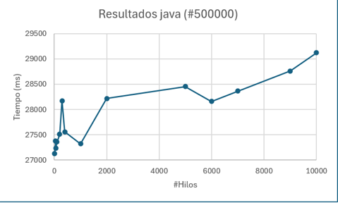

---

## Go

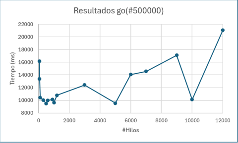

---

## Discussion of Results

At first glance, one might assume that increasing the number of threads would continuously reduce execution time because the workload is distributed among more processing units.

However, the experimental results show that this relationship is not linear.

Although execution time decreases in some cases when the number of threads increases, after a certain point the general trend is an increase in total execution time.

### Thread Creation Cost

Each thread requires system resources to be created and managed.

When thousands of threads are created, the cost of creation and management can exceed the benefits gained from dividing the workload.

### Context Switching

The processor has a limited number of physical cores.

When the number of threads greatly exceeds the number of available cores, the operating system must constantly switch between them.

This process is known as **context switching** and introduces additional overhead.

### Operating System Scheduling

The operating system scheduler must manage all active threads.

As the number of threads increases, the scheduler's workload also increases, reducing overall efficiency.

### Input and Output Operations

Printing information to the console is a relatively slow operation.

For this reason, a significant portion of the measured execution time corresponds to input/output operations rather than the counting process itself.

---

## Relationship with the Theory Studied in Class

The obtained results illustrate one of the fundamental concepts of concurrency: the existence of an optimal number of threads for a given task.

Although it is possible to create thousands of threads, this does not necessarily improve performance.

Beyond a certain point, the overhead associated with thread management, context switching, and scheduling begins to outweigh the benefits of parallelization.

This behavior explains why execution times do not decrease indefinitely and, in many cases, begin to increase.

The results also highlight an important difference between Java and Go.

Go's goroutines are considerably lighter than traditional Java threads, allowing a large number of concurrent tasks to be handled with lower overhead.

This behavior is consistent with the advantages described in the theoretical material covered during the course.

---

## General Comparison

The results show that Go achieved lower execution times than Java in most of the performed tests.

This can be attributed to the design of goroutines and the concurrency model implemented by the Go runtime.

However, both languages exhibit the same general behavior: after a certain number of threads, management overhead begins to negatively impact performance.

---

# Conclusions

* It was possible to successfully implement a concurrent program that performs counting using multiple execution threads.
* The exercise allowed us to understand fundamental concurrency concepts such as thread creation, synchronization, and concurrent execution.
* The results demonstrated that increasing the number of threads does not guarantee a reduction in execution time.
* Context switching and thread management overhead can lead to higher execution times when too many threads are used.
* Go achieved better execution times due to the efficiency of goroutines and its concurrency model.
* Concurrency is a powerful tool for improving computational resource utilization, but it must be applied appropriately to obtain real performance benefits.

---

# Appendices

The following section contains evidence of the program executions.

## Java Results

### Evidence 1

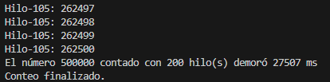

---

### Evidence 2

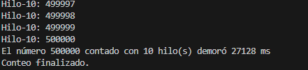

---

### Evidence 3

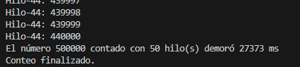

---

### Evidence 4

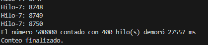

---

### Evidence 5

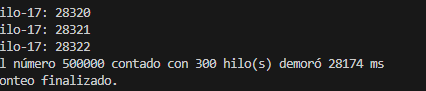

---

### Evidence 6

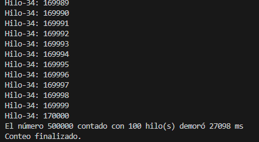

---

## Go Results

### Evidence 7

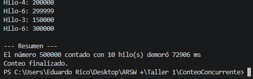

---

### Evidence 8

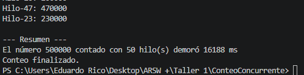

---

### Evidence 9

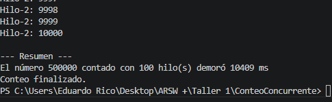

---

### Evidence 10

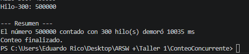

---

### Evidence 11

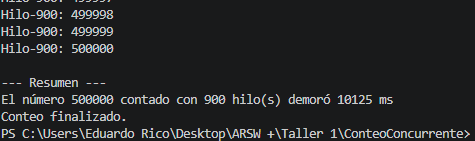

---

### Evidence 12

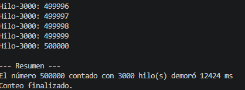

---

### Evidence 13

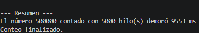

---

### Evidence 14

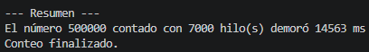

---

### Evidence 15

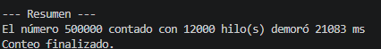

---

### Evidence 16

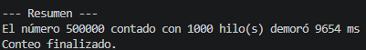

---

# References

1. Benavides Navarro, L. D., & Gualtero Martínez, R. H. (2024). *Concurrency and Threads in Java and Go* [Course slides].

2. OpenAI. (2026). *ChatGPT* (GPT-5.5 version) [Large Language Model]. https://chatgpt.com/ (Used primarily as a support tool for developing the Go implementation.)

3. Oracle. (n.d.). *The Java™ Tutorials: Concurrency*. Oracle Corporation. Retrieved June 3, 2026, from https://docs.oracle.com/javase/tutorial/essential/concurrency/

4. The Go Authors. (n.d.). *Effective Go: Concurrency*. Google. Retrieved June 3, 2026, from https://go.dev/doc/effective_go

5. Silberschatz, A., Galvin, P. B., & Gagne, G. (2018). *Operating System Concepts* (10th ed.). John Wiley & Sons.

6. Tanenbaum, A. S., & Bos, H. (2015). *Modern Operating Systems* (4th ed.). Pearson.

